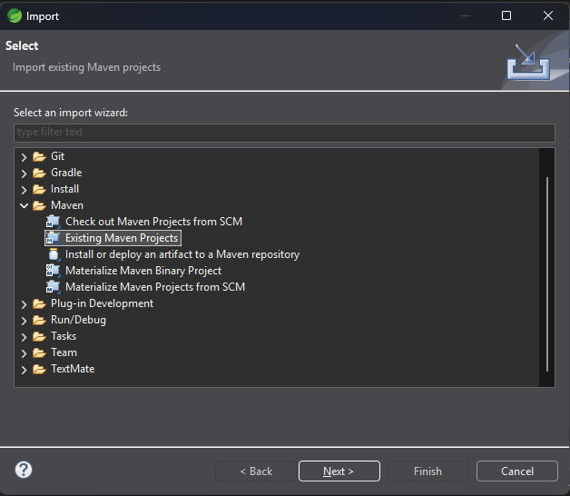
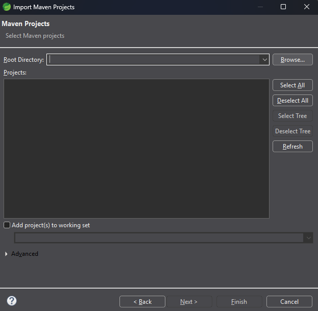
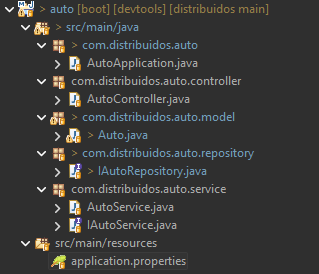

# Guía de Paso a Paso para la Creación de un Microservicio en Spring Boot

**Trabajo Práctico Nro. 1** — Microservicio `auto`
**Fecha límite de entrega:** 2 de Octubre de 2026

Microservicio básico desarrollado con **Spring Boot**, siguiendo la arquitectura en capas:

```
[ Controller ] -> [ Service ] -> [ Repository ] -> [ Bases de Datos ]
```

- El **Controller** gestiona la petición HTTP y delega la lógica al servicio.
- El **Service** procesa las reglas de negocio y solicita las operaciones de datos al repositorio.
- El **Repository** ejecuta las consultas y la persistencia directa en MySQL.

---

## 1. Configuración

Para la configurar del proyecto utilice la pagina de initializar de spring boot [start.spring.io](https://start.spring.io):


---

## 2. Importación en IDE

<!-- AGREGAR IMAGEN DE LA IMPORTACIÓN / APERTURA DEL PROYECTO EN EL IDE -->




Ingrese desde el boton browser a las carpeta que contiene nuestro proyecto lo seleccionamos



---

## 3. Creación de Estructura de Paquetes

<!-- AGREGAR IMAGEN DE LA ESTRUCTURA DE PAQUETES -->



---

## 4. Creación de la Entidad `auto` (Model)

Ubicación: `com.distribuidos.auto.model`

La clase representa la tabla `servicio-auto` en la base de datos.

```java
package com.distribuidos.auto.model;

import jakarta.persistence.Entity;
import jakarta.persistence.GeneratedValue;
import jakarta.persistence.GenerationType;
import jakarta.persistence.Id;
import lombok.Getter;
import lombok.Setter;

@Entity
public class Auto {
    @Id
    @GeneratedValue(strategy = GenerationType.IDENTITY)
    private Long id;
    private String patente;
    private String color;
    private int modelo;

    public Auto() {
    }

    public Auto(Long id, String patente, String color, int modelo) {
        this.id = id;
        this.patente = patente;
        this.color = color;
        this.modelo = modelo;
    }
    
    public Long getId() { 
    	return id; 
    }

	public String getPatente() {
		return patente;
	}

	public void setPatente(String patente) {
		this.patente = patente;
	}

	public String getColor() {
		return color;
	}

	public void setColor(String color) {
		this.color = color;
	}

	public int getModelo() {
		return modelo;
	}

	public void setModelo(int modelo) {
		this.modelo = modelo;
	}

	public void setId(Long id) {
		this.id = id;
	}
    
}
```

**Explicación:**
- `@Entity`: indica que esta clase representa un objeto de la vida real.
- `@Id` y `@GeneratedValue(strategy = GenerationType.IDENTITY)`: `id` es el identificador unico de esta entidad y se autoincrementara a medida qeue se vayan creando una o mas.

---

## 5. Interface de Repository

Ubicación: `com.distribuido.auto.repository`

```java
package com.distribuidos.auto.repository;

import com.distribuidos.auto.model.Auto;
import org.springframework.data.jpa.repository.JpaRepository;
import org.springframework.stereotype.Repository;

@Repository
public interface IAutoRepository extends JpaRepository<Auto,Long> {

}

```

**Explicación:**
- Al extender `JpaRepository<Producto, Long>` se obtienen sin escribir código los métodos `findAll()`, `findById()`, `save()`, `deleteById()`, `existsById()`, etc.
- `auto` es la entidad y `Long` es el tipo de dato de su clave primaria o id.

---

## 6. Interfaz de Service

Ubicación: `com.distribuido.auto.service`

```java
package com.distribuidos.auto.service;

import com.distribuidos.auto.model.Auto;

import java.util.List;

public interface IAutoService {

    public void crearAuto(Auto auto);

    public List<Auto> listarAutos();

}
```

**Explicación:** Define los comportamientos que puede adquirir una clase.

---
## 7. Implementación de Service

Ubicación: `com.distribuido.auto.service`

```java
package com.distribuidos.auto.service;

import com.distribuidos.auto.model.Auto;
import com.distribuidos.auto.repository.IAutoRepository;
import org.springframework.beans.factory.annotation.Autowired;
import org.springframework.stereotype.Service;

import java.util.List;

@Service
public class AutoService implements IAutoService{

    @Autowired
    private IAutoRepository repoAuto;

    @Override
    public void crearAuto(Auto auto) {
        repoAuto.save(auto);
    }

    @Override
    public List<Auto> listarAutos() {
        return repoAuto.findAll();
    }
}
```

**Explicación:**
- `@Service` Contiene las clases que implementan los comportamientos de la interfaz IAutoService para poder crear autos y listarlos.

---

## 8. Creación de Controller

Ubicación: `com.distribuido.auto.controller`

```java
package com.distribuidos.auto.controller;

import com.distribuidos.auto.model.Auto;
import com.distribuidos.auto.service.AutoService;
import org.springframework.beans.factory.annotation.Autowired;
import org.springframework.web.bind.annotation.GetMapping;
import org.springframework.web.bind.annotation.PostMapping;
import org.springframework.web.bind.annotation.RequestBody;
import org.springframework.web.bind.annotation.RestController;
import java.util.List;

@RestController
public class AutoController {

    @Autowired
    private AutoService autoServ;

    @PostMapping ("/autos/crear")
    public String creaAuto(@RequestBody Auto auto){
        autoServ.crearAuto(auto);
        return "Auto creado...";
    }

    @GetMapping("/autos/listar")
    public List<Auto> listarAutos(){
        return autoServ.listarAutos();
    }
}
```
**Explicación**
**Endpoints:** son las url de los metodos handlet de spring boot para que puedan procesar las solicitudes y respuestas del servidor a travez de los protocolos http.

| Método | URL | Descripción |
|---|---|---|
| PostMapping | `/autos/crear` | Crea los autos |
| GetMapping | `/autos/listar` | Muestra todos los autos creados en una lista |

**Explicación:** `@RestController`  en Spring Boot sirve para crear servicios web RESTful que devuelven datos directamente (como JSON o XML) en lugar de renderizar páginas HTML.

---

## 9. Configurar Properties y XAMPP

### 9.1 XAMPP

1. Abrir el panel de control de **XAMPP**.
2. Iniciar los módulos **Apache** y **MySQL** (*Start*).
3. Entrar a `http://localhost/phpmyadmin` y crear la base de datos `servicio_autos`. para crear la base de datos automáticamente.

### 9.2 `application.properties`

Archivo: `src/main/resources/application.properties`

```properties
spring.application.name=auto
server.port = 9001
spring.jpa.hibernate.ddl-auto=update
spring.datasource.url=jdbc:mysql://localhost:3306/servicio_autos?serverTimezone=UTC
spring.datasource.username=root
spring.datasource.password=

| Propiedad | Función |
| --- | --- |
| `server.port` | Puerto en el que corre el proyecto (9001) |
| `spring.jpa.hibernate.ddl-auto=update` | Crea las tablas según las entidades |
| `spring.datasource.url` | Indica la ubicacion de la base de datos conectada a MySQL |
| `spring.datasource.username` y `password` | Contienen el usuario y la contraseña de (XAMPP: `root` sin contraseña) |


3. Verificar en consola que la aplicación inició en el puerto **9001**.

### Probar con Postman, Bruno o el navegador

**Crear un auto** — `POST http://localhost:9001/productos`
Body → raw → JSON:

```json
{
  "nombre": "Teclado mecánico",
  "precio": 45000.50,
  "stock": 10
}
```
La respuesta esperada tiene que ser: `200` con el auto y su `id`.

**Listar autos** — `GET http://localhost:9001/productos`
(también se puede abrir directamente en el navegador). Respuesta: `200 OK` con la lista en JSON.

```json
{
  "nombre": "Teclado mecánico RGB",
  "precio": 52000.00,
  "stock": 8
}
```

Finalmente, verificar en **phpMyAdmin** que los datos se reflejan en la tabla `auto` de `servicio_auto`.
